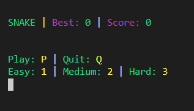
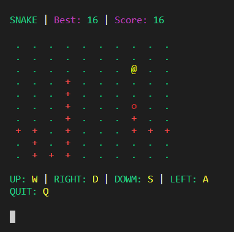

# Console Snake

### Yet another Snake clone

This is my first attempt at building something in c# outside of the Unity Engine. I wanted to try build something simple without having all the aid that Unity provides.

Nothing fancy, just text in the console.

###### check out them colours, doch fancy stuff

###### the colours are probably my favourite part, they made it feel more like a game rather than a "console application"

### About

The main() can be found in the [SnakeGame.cs](SnakeGame.cs)

Everything you'd expect from a simple snake game:

- grid based movement
- eat treats
- grow tail
- collide with tail and lose
- scoring
- multiple difficulties

Instructions are displayed on screen and are acted through pressing the relevant keys.

I added in a simple save and load for the highscore. Very insecure but it was fun to implement.

### Postmortem

I made this as a challenge to myself to make a game outside of Unity. It was fun to try something semi-new (c# is not new but using it outside of the Unity environment was) and I definitely learned a lot.

I'm fairly happy with the way my code came out. I feel that it's for the most part tidy and works smoothly. The only thing I feel a bit unsure about is the use of lots of [static modifiers](https://docs.microsoft.com/en-us/dotnet/csharp/language-reference/keywords/static). It made things nice and easy to connect since I didn't need to actually instanciate anything but I do feel that things were starting to get a bit spaghetti-ish towards the end of this project. It doesn't seem like an ideal way to do things. Also my code is 100% uncommented... I never felt like I needed any comments for myself and I guess it wouldn't be too hard for someone else to read through it.

Not sure what my next project will be but I enjoyed having this small project. Maybe I'll try some more simple console games.

### Useful Things

Below are some links which were useful in helping me publish the [self-contained exe file for the game](snake.exe). It's a relatively large file but thats the price one pays for a single file that just works.

https://www.hanselman.com/blog/MakingATinyNETCore30EntirelySelfcontainedSingleExecutable.aspx

https://dotnetcoretutorials.com/2019/06/20/publishing-a-single-exe-file-in-net-core-3-0/

https://dotnetcoretutorials.com/2019/06/27/the-publishtrimmed-flag-with-il-linker/
